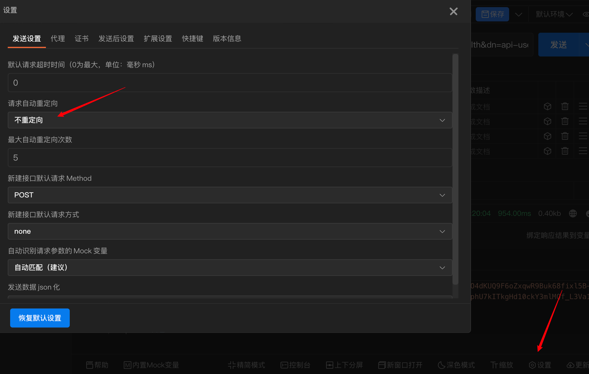
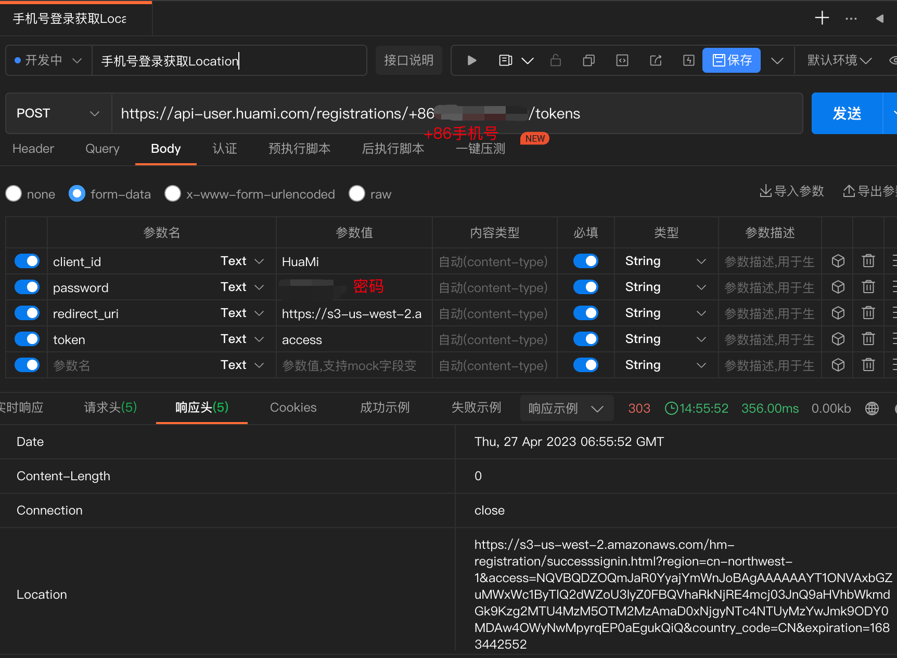
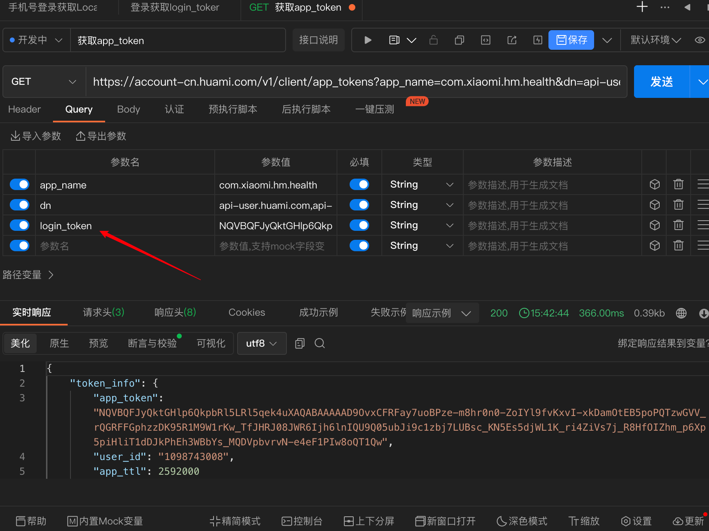
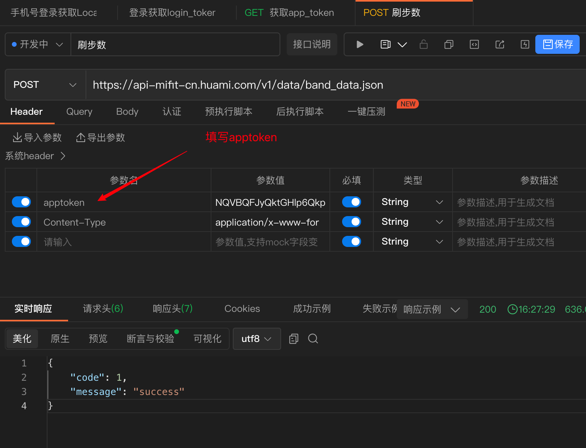
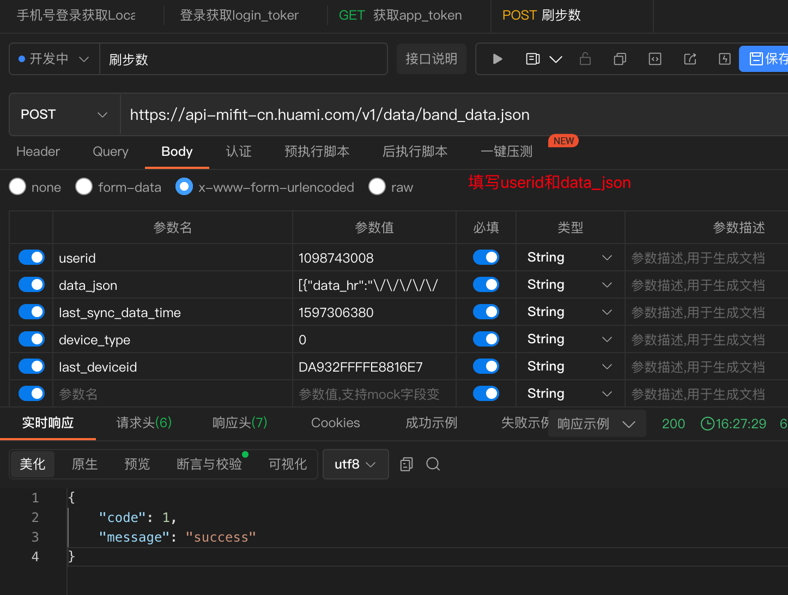
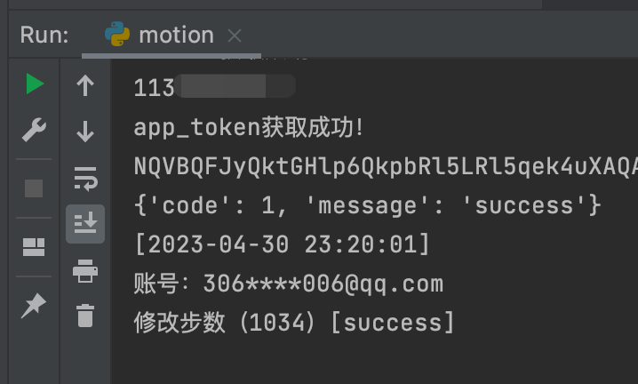
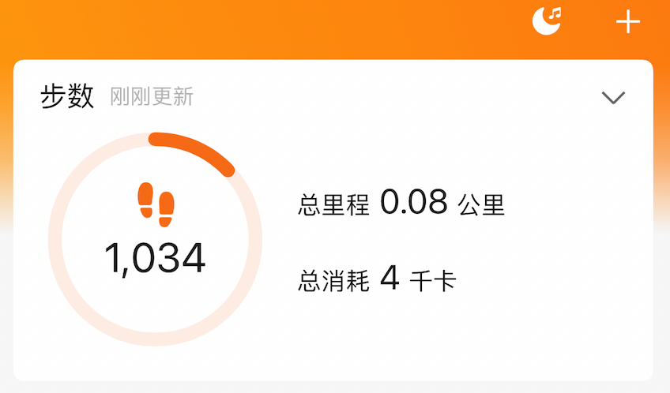

**:smile:**若此仓库对您有帮助，麻烦点个Star:star:

## 使用方法

小米运动自动刷步数的使用部署方法:tada:

### Github Actions 部署指南

1、Fork 此仓库

2、修改文件 `githubRun.py` 

最下面的 `res = main(user, password, 5000, 8000)`

5000 8000分别为最小 最大步数，请改成自己需要的步数范围:jack_o_lantern:

3、添加名为 **USER**、**PWD**、**SCKEY**的变量

在Settings-->Secrets and variables-->New repository secret

| Secrets | 格式                                                         |
| ------- | ------------------------------------------------------------ |
| USER    | 小米运动登录账号,请注意，账号不是 [小米账号]，而是 [小米运动] 的账号。 |
| PWD     | 小米运动登录密码,仅支持小米运动账号对应的密码                |
| SCKEY   | 微信消息推送的token，详情：<https://www.pushplus.plus/>      |

最后，点击action，点击刷步数，点击 run workflow 即可运行

脚本已写好执行周期，到点会自动执行。

> 脚本执行周期说明:pig:

文件 `.github/workflows/run.yml` 是 `GitHub Actions` 的执行配置

内容 `- cron: 0 4,10,14 * * *` 意思为：在国际协调时间UTC的 4点 10点 14点 执行任务，对应中国北京时间12点 18点 22点，可根据自己的需求修改

- crontab执行时间计算

  <https://tool.lu/crontab/>

- GMT UTC 时间

  <https://www.beijing-time.org/time15.asp>

### 微信小程序

具体请看：[简单的解析抖音视频和小米运动刷步数小程序](https://github.com/oddfar/FMiniProgram)

### 接口调用

> 我已把接口封装好了，可以直接使用：

请求地址：https://api.oddfar.com/g/run/motion.php

请求方式：GET

参数：`user` `password` `step`

例如：https://api.oddfar.com/g/run/motion.php?user=123456@qq.com&password=123456&step=1000


## 文件信息

`motion.py` ：python代码

`motion.php` ：php代码

`githubRun.py` ：用于 GitHub Actions 执行的python代码

## 接口信息

请求接口使用软件 `ApiPost`

接口文档分享地址：<https://console-docs.apipost.cn/preview/4b347769250ebc65/a002d5acb049cf40>

### 手机号登录获取access

手机号登录获取响应头的`Location`

改成不重定向



填写手机号和密码



在返回相应头中查看数据`Location`，结果是个url

```
https://s3-us-west-2.amazonaws.com/hm-registration/successsignin.html?region=cn-northwest-1&access=NQVBQDZOQmJaR0YyajYmWnJoBAgAAAAAAYT1ONVAxbGZuMWxWc1ByTlQ2dWZoU3lyZ0FBQVhaRkNjRE4mcj03JnQ9aHVhbWkmdGk9Kzg2MTU4MzM5OTM2MzAmaD0xNjgyNTc4NTUyMzYwJmk9ODY0MDAw4OWyNwMpyrqEP0aEgukQiQ&country_code=CN&expiration=1683442552
```

获取 `access` 参数

```
NQVBQDZOQmJaR0YyajYmWnJoBAgAAAAAAYT1ONVAxbGZuMWxWc1ByTlQ2dWZoU3lyZ0FBQVhaRkNjRE4mcj03JnQ9aHVhbWkmdGk9Kzg2MTU4MzM5OTM2MzAmaD0xNjgyNTc4NTUyMzYwJmk9ODY0MDAw4OWyNwMpyrqEP0aEgukQiQ
```

### 登录获取login_token

`code` 就是之前获取到的 `access` 参数

`login_token` 在返回结果里


### 获取app_token

写入 `login_token` 获取 `app_token`




### 刷步数

header参数填写 `app_token`

请求参数 `t` 为时间戳，例如：1682583902000

实测不加上t参数，接口也可以请求



body参数中填写 `userid` `data_json`

最后请求接口，返回 success 代表成功



### 关于data_json

需要替换两组数据

- 1000：要刷的步数，改成想刷的步数
- 2023-04-27：改成今天的日期

以下为data_json数据，日期为`2023-04-27`，步数为`1000`

```json
[{"data_hr":"\/\/\/\/\/\/9L\/\/\/\/\/\/\/\/\/\/\/\/Vv\/\/\/\/\/\/\/\/\/\/\/0v\/\/\/\/\/\/\/\/\/\/\/9e\/\/\/\/\/0n\/a\/\/\/S\/\/\/\/\/\/\/\/\/\/\/\/0b\/\/\/\/\/\/\/\/\/\/1FK\/\/\/\/\/\/\/\/\/\/\/\/R\/\/\/\/\/\/\/\/\/\/\/\/\/\/\/\/\/9PTFFpaf9L\/\/\/\/\/\/\/\/\/\/\/\/R\/\/\/\/\/\/\/\/\/\/\/\/0j\/\/\/\/\/\/\/\/\/\/\/9K\/\/\/\/\/\/\/\/\/\/\/\/Ov\/\/\/\/\/\/\/\/\/\/\/zf\/\/\/86\/zr\/Ov88\/zf\/Pf\/\/\/0v\/S\/8\/\/\/\/\/\/\/\/\/\/\/\/\/Sf\/\/\/\/\/\/\/\/\/\/\/z3\/\/\/\/\/\/0r\/Ov\/\/\/\/\/\/S\/9L\/zb\/Sf9K\/0v\/Rf9H\/zj\/Sf9K\/0\/\/N\/\/\/\/0D\/Sf83\/zr\/Pf9M\/0v\/Ov9e\/\/\/\/\/\/\/\/\/\/\/\/S\/\/\/\/\/\/\/\/\/\/\/\/zv\/\/z7\/O\/83\/zv\/N\/83\/zr\/N\/86\/z\/\/Nv83\/zn\/Xv84\/zr\/PP84\/zj\/N\/9e\/zr\/N\/89\/03\/P\/89\/z3\/Q\/9N\/0v\/Tv9C\/0H\/Of9D\/zz\/Of88\/z\/\/PP9A\/zr\/N\/86\/zz\/Nv87\/0D\/Ov84\/0v\/O\/84\/zf\/MP83\/zH\/Nv83\/zf\/N\/84\/zf\/Of82\/zf\/OP83\/zb\/Mv81\/zX\/R\/9L\/0v\/O\/9I\/0T\/S\/9A\/zn\/Pf89\/zn\/Nf9K\/07\/N\/83\/zn\/Nv83\/zv\/O\/9A\/0H\/Of8\/\/zj\/PP83\/zj\/S\/87\/zj\/Nv84\/zf\/Of83\/zf\/Of83\/zb\/Nv9L\/zj\/Nv82\/zb\/N\/85\/zf\/N\/9J\/zf\/Nv83\/zj\/Nv84\/0r\/Sv83\/zf\/MP\/\/\/zb\/Mv82\/zb\/Of85\/z7\/Nv8\/\/0r\/S\/85\/0H\/QP9B\/0D\/Nf89\/zj\/Ov83\/zv\/Nv8\/\/0f\/Sv9O\/0ZeXv\/\/\/\/\/\/\/\/\/\/\/1X\/\/\/\/\/\/\/\/\/\/\/9B\/\/\/\/\/\/\/\/\/\/\/\/TP\/\/\/1b\/\/\/\/\/\/0\/\/\/\/\/\/\/\/\/\/\/\/9N\/\/\/\/\/\/\/\/\/v7+\/v7+\/v7+\/v7+\/v7+\/v7+\/v7+\/v7+\/v7+\/v7+\/v7+\/v7+\/v7+\/v7+\/v7+\/v7+\/v7+\/v7+\/v7+\/v7+\/v7+\/v7+\/v7+\/v7+\/v7+\/v7+\/v7+\/v7+\/v7+\/v7+\/v7+\/v7+\/v7+\/v7+\/v7+\/v7+\/v7+\/v7+\/v7+\/v7+\/v7+\/v7+\/v7+\/v7+\/v7+\/v7+\/v7+\/v7+\/v7+\/v7+\/v7+\/v7+\/v7+\/v7+\/v7+\/v7+\/v7+\/v7+\/v7+\/v7+\/v7+\/v7+\/v7+\/v7+\/v7+\/v7+\/v7+\/v7+\/v7+\/v7+\/v7+\/v7+\/v7+\/v7+\/v7+\/v7+\/v7+\/v7+\/v7+\/v7+\/v7+\/v7+\/v7+\/v7+\/v7+\/v7+\/v7+\/v7+\/v7+\/v7+\/v7+\/v7+\/v7+\/v7+\/v7+\/v7+\/v7+\/v7+\/v7+\/v7+\/v7+\/v7+\/v7+\/v7+\/v7+\/v7+\/v7+\/v7+\/v7+\/v7+\/v7+\/v7+\/v7+\/v7+\/v7+\/v7+\/v7+\/v7+\/v7+\/v7+\/v7+\/v7+\/v7+\/v7+\/v7+\/v7+\/v7+\/v7+\/v7+\/v7+\/v7+\/v7+\/v7+\/v7+\/v7+\/v7+\/v7+\/v7+\/v7+\/v7+\/v7+\/v7+\/v7+\/v7+\/v7+\/v7+\/v7+\/v7+\/v7+\/v7+\/v7+\/v7+\/v7+\/v7+\/v7+\/v7+\/v7+\/v7+\/v7+\/v7+\/v7+\/v7+\/v7+\/v7+\/v7+\/v7+\/v7+\/v7+\/v7+\/v7+\/v7+\/v7+\/v7+\/v7+\/v7+\/v7+\/v7+\/v7+\/v7+\/v7+\/v7+\/v7+\/v7+\/v7+\/v7+\/v7+\/v7+\/v7+\/v7+\/v7+\/v7+\/v7+\/v7+\/v7+\/v7+\/v7+\/v7+\/v7+\/v7+\/v7+\/v7+\/v7+\/v7+\/v7+\/v7+\/v7+\/v7+\/v7+\/v7+\/v7+\/v7+\/v7+\/v7+\/v7+\/v7+\/v7+\/v7+\/v7+\/v7+\/v7+\/v7+\/v7+\/v7+\/v7+\/v7+\/v7+\/v7+\/v7+\/v7+\/v7+\/v7+\/v7+\/v7+\/v7+\/v7+\/v7+\/v7+\/v7+\/v7+\/v7+\/v7+\/v7+\/v7+\/v7+\/v7+\/v7+\/v7+\/v7+\/v7+\/v7+\/v7+\/v7+\/v7+\/v7+\/v7+\/v7+\/v7+\/v7+\/v7+\/v7+\/v7+","date":"2023-04-27","data":[{"start":0,"stop":1439,"value":"UA8AUBQAUAwAUBoAUAEAYCcAUBkAUB4AUBgAUCAAUAEAUBkAUAwAYAsAYB8AYB0AYBgAYCoAYBgAYB4AUCcAUBsAUB8AUBwAUBIAYBkAYB8AUBoAUBMAUCEAUCIAYBYAUBwAUCAAUBgAUCAAUBcAYBsAYCUAATIPYD0KECQAYDMAYB0AYAsAYCAAYDwAYCIAYB0AYBcAYCQAYB0AYBAAYCMAYAoAYCIAYCEAYCYAYBsAYBUAYAYAYCIAYCMAUB0AUCAAUBYAUCoAUBEAUC8AUB0AUBYAUDMAUDoAUBkAUC0AUBQAUBwAUA0AUBsAUAoAUCEAUBYAUAwAUB4AUAwAUCcAUCYAUCwKYDUAAUUlEC8IYEMAYEgAYDoAYBAAUAMAUBkAWgAAWgAAWgAAWgAAWgAAUAgAWgAAUBAAUAQAUA4AUA8AUAkAUAIAUAYAUAcAUAIAWgAAUAQAUAkAUAEAUBkAUCUAWgAAUAYAUBEAWgAAUBYAWgAAUAYAWgAAWgAAWgAAWgAAUBcAUAcAWgAAUBUAUAoAUAIAWgAAUAQAUAYAUCgAWgAAUAgAWgAAWgAAUAwAWwAAXCMAUBQAWwAAUAIAWgAAWgAAWgAAWgAAWgAAWgAAWgAAWgAAWREAWQIAUAMAWSEAUDoAUDIAUB8AUCEAUC4AXB4AUA4AWgAAUBIAUA8AUBAAUCUAUCIAUAMAUAEAUAsAUAMAUCwAUBYAWgAAWgAAWgAAWgAAWgAAWgAAUAYAWgAAWgAAWgAAUAYAWwAAWgAAUAYAXAQAUAMAUBsAUBcAUCAAWwAAWgAAWgAAWgAAWgAAUBgAUB4AWgAAUAcAUAwAWQIAWQkAUAEAUAIAWgAAUAoAWgAAUAYAUB0AWgAAWgAAUAkAWgAAWSwAUBIAWgAAUC4AWSYAWgAAUAYAUAoAUAkAUAIAUAcAWgAAUAEAUBEAUBgAUBcAWRYAUA0AWSgAUB4AUDQAUBoAXA4AUA8AUBwAUA8AUA4AUA4AWgAAUAIAUCMAWgAAUCwAUBgAUAYAUAAAUAAAUAAAUAAAUAAAUAAAUAAAUAAAUAAAWwAAUAAAcAAAcAAAcAAAcAAAcAAAcAAAcAAAcAAAcAAAcAAAcAAAcAAAcAAAcAAAcAAAcAAAcAAAcAAAcAAAcAAAcAAAcAAAcAAAcAAAcAAAeSEAeQ8AcAAAcAAAcAAAcAAAcAAAcAAAcAAAcAAAcAAAcAAAcAAAcAAAcBcAcAAAcAAAcCYOcBUAUAAAUAAAUAAAUAAAUAUAUAAAcAAAcAAAcAAAcAAAcAAAcAAAcAAAcAAAcAAAcAAAcAAAcAAAcAAAcAAAcAAAcCgAeQAAcAAAcAAAcAAAcAAAcAAAcAYAcAAAcBgAeQAAcAAAcAAAegAAegAAcAAAcAcAcAAAcAAAcAAAcAAAcAAAcAAAcAAAcAAAcAAAcAAAcAAAcAAAcAAAcAAAcAAAcCkAeQAAcAcAcAAAcAAAcAwAcAAAcAAAcAIAcAAAcAAAcAAAcAAAcAAAcAAAcAAAcAAAcAAAcAAAcAAAcAAAcAAAcAAAcAAAcAAAcAAAcAAAcCIAeQAAcAAAcAAAcAAAcAAAcAAAeRwAeQAAWgAAUAAAUAAAUAAAUAAAUAAAcAAAcAAAcBoAeScAeQAAegAAcBkAeQAAUAAAUAAAUAAAUAAAUAAAUAAAcAAAcAAAcAAAcAAAcAAAcAAAegAAegAAcAAAcAAAcBgAeQAAcAAAcAAAcAAAcAAAcAAAcAkAegAAegAAcAcAcAAAcAcAcAAAcAAAcAAAcAAAcA8AeQAAcAAAcAAAeRQAcAwAUAAAUAAAUAAAUAAAUAAAUAAAcAAAcBEAcA0AcAAAWQsAUAAAUAAAUAAAUAAAUAAAcAAAcAoAcAAAcAAAcAAAcAAAcAAAcAAAcAAAcAYAcAAAcAAAcAAAcAAAcAAAcAAAcAAAcAAAcBYAegAAcAAAcAAAegAAcAcAcAAAcAAAcAAAcAAAcAAAeRkAegAAegAAcAAAcAAAcAAAcAAAcAAAcAAAcAAAcAEAcAAAcAAAcAAAcAUAcAQAcAAAcBIAeQAAcAAAcAAAcAAAcAAAcAAAcAAAcAAAcAAAcAAAcAAAcAAAcAAAcBsAcAAAcAAAcBcAeQAAUAAAUAAAUAAAUAAAUAAAUBQAcBYAUAAAUAAAUAoAWRYAWTQAWQAAUAAAUAAAUAAAcAAAcAAAcAAAcAAAcAAAcAMAcAAAcAQAcAAAcAAAcAAAcDMAeSIAcAAAcAAAcAAAcAAAcAAAcAAAcAAAcAAAcAAAcAAAcAAAcAAAcAAAcAAAcAAAcAAAcAAAcAAAcAAAcBQAeQwAcAAAcAAAcAAAcAMAcAAAeSoAcA8AcDMAcAYAeQoAcAwAcFQAcEMAeVIAaTYAbBcNYAsAYBIAYAIAYAIAYBUAYCwAYBMAYDYAYCkAYDcAUCoAUCcAUAUAUBAAWgAAYBoAYBcAYCgAUAMAUAYAUBYAUA4AUBgAUAgAUAgAUAsAUAsAUA4AUAMAUAYAUAQAUBIAASsSUDAAUDAAUBAAYAYAUBAAUAUAUCAAUBoAUCAAUBAAUAoAYAIAUAQAUAgAUCcAUAsAUCIAUCUAUAoAUA4AUB8AUBkAfgAAfgAAfgAAfgAAfgAAfgAAfgAAfgAAfgAAfgAAfgAAfgAAfgAAfgAAfgAAfgAAfgAAfgAAfgAAfgAAfgAAfgAAfgAAfgAAfgAAfgAAfgAAfgAAfgAAfgAAfgAAfgAAfgAAfgAAfgAAfgAAfgAAfgAAfgAAfgAAfgAAfgAAfgAAfgAAfgAAfgAAfgAAfgAAfgAAfgAAfgAAfgAAfgAAfgAAfgAAfgAAfgAAfgAAfgAAfgAAfgAAfgAAfgAAfgAAfgAAfgAAfgAAfgAAfgAAfgAAfgAAfgAAfgAAfgAAfgAAfgAAfgAAfgAAfgAAfgAAfgAAfgAAfgAAfgAAfgAAfgAAfgAAfgAAfgAAfgAAfgAAfgAAfgAAfgAAfgAAfgAAfgAAfgAAfgAAfgAAfgAAfgAAfgAAfgAAfgAAfgAAfgAAfgAAfgAAfgAAfgAAfgAAfgAAfgAAfgAAfgAAfgAAfgAAfgAAfgAAfgAAfgAAfgAAfgAAfgAAfgAAfgAAfgAAfgAAfgAAfgAAfgAAfgAAfgAAfgAAfgAAfgAAfgAAfgAAfgAAfgAAfgAAfgAAfgAAfgAAfgAAfgAAfgAAfgAAfgAAfgAAfgAAfgAAfgAAfgAAfgAAfgAAfgAAfgAAfgAAfgAAfgAAfgAAfgAAfgAAfgAAfgAAfgAAfgAAfgAAfgAAfgAAfgAAfgAAfgAAfgAAfgAAfgAAfgAAfgAAfgAAfgAAfgAAfgAAfgAAfgAAfgAAfgAAfgAAfgAAfgAAfgAAfgAAfgAAfgAAfgAAfgAAfgAAfgAAfgAAfgAAfgAAfgAAfgAAfgAAfgAAfgAAfgAAfgAAfgAAfgAAfgAAfgAAfgAAfgAAfgAAfgAAfgAAfgAAfgAAfgAAfgAAfgAAfgAAfgAAfgAAfgAAfgAAfgAAfgAAfgAAfgAAfgAAfgAAfgAAfgAAfgAAfgAAfgAAfgAAfgAAfgAAfgAAfgAAfgAAfgAAfgAAfgAAfgAAfgAAfgAAfgAAfgAAfgAAfgAAfgAAfgAAfgAAfgAAfgAAfgAAfgAAfgAAfgAAfgAAfgAAfgAAfgAAfgAAfgAAfgAAfgAAfgAAfgAAfgAAfgAAfgAAfgAAfgAAfgAAfgAAfgAAfgAAfgAAfgAAfgAAfgAAfgAAfgAAfgAAfgAAfgAAfgAAfgAAfgAAfgAAfgAAfgAAfgAAfgAAfgAAfgAAfgAAfgAAfgAAfgAAfgAAfgAAfgAAfgAAfgAAfgAAfgAAfgAAfgAAfgAAfgAAfgAAfgAAfgAAfgAAfgAAfgAAfgAAfgAAfgAAfgAAfgAAfgAAfgAAfgAAfgAAfgAAfgAAfgAAfgAAfgAAfgAAfgAAfgAAfgAAfgAAfgAAfgAAfgAAfgAAfgAAfgAAfgAAfgAAfgAAfgAAfgAAfgAAfgAAfgAAfgAAfgAAfgAAfgAAfgAAfgAAfgAAfgAAfgAAfgAAfgAAfgAAfgAAfgAAfgAAfgAAfgAAfgAAfgAAfgAAfgAAfgAAfgAAfgAAfgAAfgAAfgAAfgAAfgAAfgAAfgAAfgAAfgAAfgAAfgAAfgAAfgAAfgAAfgAAfgAAfgAAfgAAfgAAfgAAfgAAfgAAfgAAfgAAfgAAfgAAfgAAfgAAfgAAfgAAfgAAfgAAfgAAfgAAfgAAfgAAfgAAfgAAfgAAfgAAfgAAfgAAfgAAfgAAfgAAfgAAfgAAfgAAfgAAfgAAfgAAfgAAfgAAfgAAfgAAfgAAfgAAfgAAfgAAfgAAfgAAfgAAfgAAfgAAfgAAfgAAfgAAfgAAfgAAfgAAfgAAfgAAfgAAfgAAfgAAfgAAfgAAfgAAfgAAfgAAfgAAfgAAfgAAfgAAfgAAfgAAfgAAfgAAfgAAfgAAfgAAfgAAfgAAfgAAfgAAfgAAfgAAfgAAfgAAfgAAfgAAfgAAfgAAfgAAfgAAfgAAfgAAfgAAfgAAfgAAfgAAfgAAfgAAfgAAfgAAfgAAfgAAfgAAfgAAfgAAfgAAfgAAfgAAfgAAfgAAfgAAfgAAfgAAfgAAfgAAfgAAfgAAfgAAfgAAfgAAfgAAfgAAfgAAfgAAfgAAfgAAfgAAfgAAfgAAfgAAfgAAfgAAfgAAfgAAfgAAfgAAfgAAfgAAfgAAfgAAfgAAfgAAfgAAfgAAfgAAfgAAfgAAfgAAfgAAfgAAfgAAfgAAfgAAfgAAfgAAfgAAfgAAfgAAfgAAfgAAfgAAfgAAfgAAfgAAfgAAfgAAfgAAfgAAfgAAfgAAfgAAfgAAfgAAfgAAfgAAfgAAfgAAfgAAfgAAfgAAfgAAfgAAfgAAfgAAfgAAfgAAfgAAfgAAfgAAfgAAfgAAfgAAfgAAfgAAfgAAfgAAfgAAfgAAfgAAfgAAfgAAfgAAfgAAfgAAfgAAfgAAfgAAfgAAfgAAfgAAfgAAfgAAfgAAfgAAfgAAfgAAfgAAfgAAfgAAfgAAfgAAfgAAfgAAfgAAfgAAfgAAfgAAfgAAfgAAfgAAfgAAfgAAfgAAfgAAfgAAfgAAfgAAfgAAfgAAfgAAfgAAfgAAfgAAfgAAfgAAfgAAfgAAfgAAfgAAfgAAfgAAfgAAfgAAfgAAfgAAfgAAfgAAfgAAfgAAfgAAfgAAfgAAfgAAfgAAfgAAfgAAfgAAfgAAfgAAfgAAfgAAfgAAfgAAfgAAfgAAfgAAfgAAfgAAfgAAfgAAfgAAfgAAfgAAfgAAfgAAfgAAfgAAfgAAfgAAfgAAfgAAfgAAfgAAfgAAfgAAfgAAfgAAfgAAfgAAfgAAfgAAfgAAfgAAfgAAfgAAfgAAfgAAfgAAfgAAfgAAfgAAfgAAfgAAfgAAfgAAfgAAfgAAfgAAfgAAfgAAfgAAfgAAfgAAfgAAfgAAfgAAfgAAfgAAfgAAfgAAfgAAfgAAfgAAfgAAfgAAfgAAfgAAfgAAfgAAfgAAfgAAfgAAfgAAfgAAfgAAfgAAfgAAfgAAfgAAfgAAfgAAfgAAfgAAfgAAfgAAfgAAfgAAfgAAfgAAfgAAfgAAfgAAfgAAfgAAfgAAfgAAfgAAfgAAfgAAfgAAfgAAfgAAfgAAfgAAfgAAfgAAfgAAfgAAfgAAfgAAfgAAfgAAfgAAfgAAfgAAfgAAfgAAfgAA","tz":32,"did":"DA932FFFFE8816E7","src":24}],"summary":"{\"v\":6,\"slp\":{\"st\":1628296479,\"ed\":1628296479,\"dp\":0,\"lt\":0,\"wk\":0,\"usrSt\":-1440,\"usrEd\":-1440,\"wc\":0,\"is\":0,\"lb\":0,\"to\":0,\"dt\":0,\"rhr\":0,\"ss\":0},\"stp\":{\"ttl\":1000,\"dis\":10627,\"cal\":510,\"wk\":41,\"rn\":50,\"runDist\":7654,\"runCal\":397,\"stage\":[{\"start\":327,\"stop\":341,\"mode\":1,\"dis\":481,\"cal\":13,\"step\":680},{\"start\":342,\"stop\":367,\"mode\":3,\"dis\":2295,\"cal\":95,\"step\":2874},{\"start\":368,\"stop\":377,\"mode\":4,\"dis\":1592,\"cal\":88,\"step\":1664},{\"start\":378,\"stop\":386,\"mode\":3,\"dis\":1072,\"cal\":51,\"step\":1245},{\"start\":387,\"stop\":393,\"mode\":4,\"dis\":1036,\"cal\":57,\"step\":1124},{\"start\":394,\"stop\":398,\"mode\":3,\"dis\":488,\"cal\":19,\"step\":607},{\"start\":399,\"stop\":414,\"mode\":4,\"dis\":2220,\"cal\":120,\"step\":2371},{\"start\":415,\"stop\":427,\"mode\":3,\"dis\":1268,\"cal\":59,\"step\":1489},{\"start\":428,\"stop\":433,\"mode\":1,\"dis\":152,\"cal\":4,\"step\":238},{\"start\":434,\"stop\":444,\"mode\":3,\"dis\":2295,\"cal\":95,\"step\":2874},{\"start\":445,\"stop\":455,\"mode\":4,\"dis\":1592,\"cal\":88,\"step\":1664},{\"start\":456,\"stop\":466,\"mode\":3,\"dis\":1072,\"cal\":51,\"step\":1245},{\"start\":467,\"stop\":477,\"mode\":4,\"dis\":1036,\"cal\":57,\"step\":1124},{\"start\":478,\"stop\":488,\"mode\":3,\"dis\":488,\"cal\":19,\"step\":607},{\"start\":489,\"stop\":499,\"mode\":4,\"dis\":2220,\"cal\":120,\"step\":2371},{\"start\":500,\"stop\":511,\"mode\":3,\"dis\":1268,\"cal\":59,\"step\":1489},{\"start\":512,\"stop\":522,\"mode\":1,\"dis\":152,\"cal\":4,\"step\":238}]},\"goal\":8000,\"tz\":\"28800\"}","source":24,"type":0}]
```


### 关于邮箱登录

和手机号登录接口一样，但登录获取 `login_token` 提交的参数不一样，具体请参考代码或者接口文档

```
code:code内容自己修改
app_name:com.xiaomi.hm.health
app_version:6.3.5
country_code:CN
device_id:2C8B4939-0CCD-4E94-8CBA-CB8EA6E613A1
device_model:phone
dn:api-user.huami.com%2Capi-mifit.huami.com%2Capp-analytics.huami.com
grant_type:access_token
lang:zh_CN
os_version:1.5.0
source:com.xiaomi.hm.health
third_name:email
```


### 执行结果






## 参考资料

- 小米运动刷步数（微信支付宝）支持邮箱登录

  https://github.com/huangshihai/mimotion

- AI Code Translator

  https://ai-code-translator.vercel.app/

- https://github.com/matocool/motion-for-email

## 常见问题

### 账号被黑

1、在支付宝设置-隐私-个人授权管理-取消对zepp Life的授权，然后注销zeppLIfe账号，重新绑定

2、在支付宝取消授权后，新注册一个zepp Life邮箱账号并绑定支付宝即可，接下来就是利用action来刷步数。

注：目前发现是zepp life的账号变黑号导致无法同步。

手上几个号，原来是手机号，利用新注册的邮箱账号均可成功。另有2个号是手机号，没有黑，依然可用继续同步。

新注册一个zepp Life账号尽可能别用的设备，比如电脑下个安卓模拟器去注册，因为用老设备注册的号可能依然是黑号。

以上办法仅做尝试，并不能保证所有人都有效。

有人反馈绑定手环的账号是不受影响。如果无效可以考虑这个方案。
